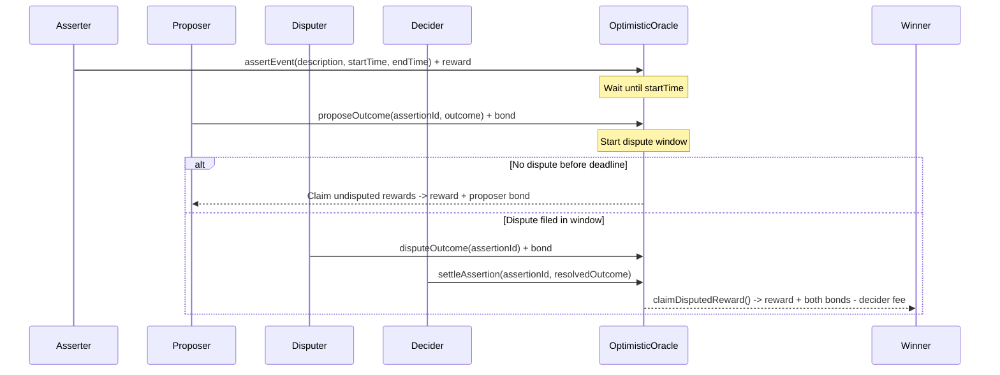

# 🔮 Oracle Challenge


🔗 Build your own decentralized oracle systems! In this challenge, you'll explore three fundamental oracle architectures that power the decentralized web: **Whitelist Oracle**, **Staking Oracle**, and **Optimistic Oracle**.

🧠 You'll dive deep into the mechanics of bringing real-world data onto the blockchain, understanding the critical trade-offs between security, decentralization, and efficiency. Each oracle design represents a different approach to solving the fundamental problem: how do we trust data that comes from outside the blockchain?

<details markdown='1'><summary>❓ Wondering what an oracle is? Read the overview here.</summary>

Oracles are bridges between blockchains and the external world. They solve a fundamental problem: smart contracts can only access data that exists on the blockchain, but most real-world data (prices, weather, sports scores, etc.) exists off-chain.

🤔 Why are oracles important?

- **DeFi Protocols**: Need accurate price feeds for lending, trading, and liquidation
- **Insurance**: Require real-world event verification (weather, flight delays)
- **Gaming**: Need random numbers and external event outcomes
- **Supply Chain**: Track real-world goods and events

🔒 Why are oracles difficult?

- **Trust**: How do we know the oracle is telling the truth?
- **Centralization**: Single points of failure can compromise entire protocols
- **Incentives**: How do we align oracle behavior with protocol needs?
- **Latency**: Real-time data needs to be fresh and accurate

👍 Now that you understand the basics, let's look at three different oracle systems!

</details>

---

🌟 The final deliverable is a comprehensive understanding of oracle architectures through exploration and hands-on implementation. You'll explore two existing oracle systems (Whitelist and Staking) to understand their mechanics, then implement the Optimistic Oracle from scratch. Deploy your optimistic oracle to a testnet and demonstrate how it handles assertions, proposals, disputes, and settlements.

🔍 First, let's understand why we need multiple oracle designs. Each approach has different strengths:

- **Whitelist Oracle**: Simple and fast, but requires trust in a centralized authority
- **Staking Oracle**: Decentralized with economic incentives, but more complex
- **Optimistic Oracle**: Dispute-based with strong security guarantees, but higher latency

📚 This challenge is inspired by real-world oracle systems like Chainlink, Pyth Network, and UMA Protocol. Each design pattern you'll implement has been battle-tested in production environments.

💬 Meet other builders working on this challenge and get help in the [Oracle Challenge Telegram](https://t.me/+AkmcMB3jC3A0NDcx)

---

## Checkpoint 0: 📦 Environment 📚

🛠️ Before you begin, you need to install the following tools:

- [Node (>=20.18.3)](https://nodejs.org/en/download/)
- Yarn ([v1](https://classic.yarnpkg.com/en/docs/install/) or [v2+](https://yarnpkg.com/getting-started/install))
- [Git](https://git-scm.com/downloads)

📥 Then download the challenge to your computer and install dependencies by running:

```sh

npx create-eth@0.2.4 -e scaffold-eth/se-2-challenges:challenge-oracles challenge-oracles

cd challenge-oracles

```

> 💻 In the same terminal, start your local network (a blockchain emulator in your computer):

```sh

yarn chain

```

> 🛰️ In a second terminal window, deploy your contract (locally):

```sh

cd challenge-oracles

yarn deploy

```

> 📱 In a third terminal window, start your frontend:

```sh

cd challenge-oracles

yarn start

```

📱 Open http://localhost:3000 to see the app.

> 👩‍💻 Rerun `yarn deploy` whenever you want to deploy new contracts to the frontend. If you haven't made any contract changes, you can run `yarn deploy --reset` for a completely fresh deploy.

---

## Checkpoint 1: 🏛️ Whitelist Oracle Overview

🔍 Let's start the simplest of the three oracle designs we'll cover: the Whitelist Oracle. This design uses a centralized authority to control which data sources can provide information, making it simple and fast but requiring trust.

💰 The implementation we'll be looking at is a **price** oracle. Price oracles are one of the most common and critical types of oracles in DeFi, as they enable smart contracts to make decisions based on real-world asset prices. Our whitelist price oracle collects price reports from multiple trusted sources (instances of `SimpleOracle`) and returns their median value.

🗂️ The whitelist oracle contracts are located in `packages/hardhat/contracts`. Go check them out and reference the following descriptions.

### Core Components

1. 🔗 **SimpleOracle (`SimpleOracle.sol`)**

- Basic oracle contract that allows price updates from the contract owner (We have commented out the onlyOwner modifier to allow you to impersonate the owner)

- Each SimpleOracle represents one trusted data source

2. 🏛️ **WhitelistOracle (`WhitelistOracle.sol`)**

- Central contract that aggregates multiple SimpleOracle contracts

- Only the owner can add/remove SimpleOracle contracts from the whitelist (We have commented out the onlyOwner modifier to allow you to impersonate the owner)

- Uses median calculation for consensus among whitelisted sources

- Filters out stale data to ensure freshness

- Simple architecture but requires trust in the whitelist authority

---

## Checkpoint 2: 🔗 Simple Oracle & Whitelist Oracle - Building Blocks & Aggregation

🧭 Let's understand how oracle systems are built from simple components and then aggregated for better reliability. We'll examine both the basic building block (SimpleOracle) and how multiple simple oracles can be combined into a more robust system (WhitelistOracle).

### 🔗 Simple Oracle - The Building Block

🔍 Open the `packages/hardhat/contracts/00_Whitelist/SimpleOracle.sol` file to examine the basic oracle functionality.

#### 📖 Understanding the Code:

🧩 The `SimpleOracle` contract is the fundamental building block of this oracle system:

1. **`setPrice(uint256 _newPrice)`** - This function allows the contract owner to update the current price

* 🔄 Updates the `price` state variable with the new value

* ⏱️ Updates the `timestamp` to the current block timestamp

* 📣 Emits the `PriceUpdated` event with the new price

2. **`getPrice()`** - This function returns both the current price and timestamp

* ↩️ Returns them as a tuple: `(price, timestamp)`

#### 🤔 Key Insights:

- **Single Source**: Each SimpleOracle represents one data source
- **Trust Model**: Requires complete trust in whoever updates the price
- **Limitations**: No consensus mechanism, no economic incentives

### 🏛️ Whitelist Oracle - Aggregating Multiple Sources

🔍 Open the `packages/hardhat/contracts/00_Whitelist/WhitelistOracle.sol` file to examine how multiple SimpleOracle contracts are aggregated.

#### 📖 Understanding the Relationship:

The `WhitelistOracle` contract **aggregates data from multiple SimpleOracle contracts**:

```solidity

SimpleOracle[] public oracles;  *// Array of SimpleOracle contracts*

```

🏗️ This creates a **hierarchical oracle system**:

- **Individual Level**: Each SimpleOracle contract is managed by a trusted (theoretically) data provider
- **Aggregation Level**: The WhitelistOracle collects and processes data from all whitelisted SimpleOracle contracts

#### 📖 Understanding the Code:

1. **`addOracle(address oracle)`** - Adds a SimpleOracle contract to the whitelist

* ✔️ Validates the oracle address is not zero

* 🧪 Checks for duplicates in the existing list

* ➕ Adds the SimpleOracle to the `oracles` array

* 📣 Emits the `OracleAdded` event

2. **`removeOracle(uint256 index)`** - Removes a SimpleOracle from the whitelist

* ✔️ Validates the index is within bounds

* ➖ Efficiently removes the oracle (swaps with last element)

* 📣 Emits the `OracleRemoved` event

3. **`getPrice()`** - Aggregates prices from all whitelisted SimpleOracle contracts

* 🔁 Loops through each SimpleOracle in the whitelist

* 📡 Calls `getPrice()` on each SimpleOracle to get `(price, timestamp)`

* 🧹 Filters out stale prices (older than 10 seconds)

* 🧮 Calculates the median of valid prices

* ⛔️ Reverts if no valid prices are available

#### 🤔 Key Insights:

- **Composition Pattern**: WhitelistOracle is composed of multiple SimpleOracle contracts
- **Centralized Authority**: Only the owner can add/remove SimpleOracle contracts
- **Consensus Mechanism**: Uses median calculation to resist outliers from individual SimpleOracle contracts
- **Freshness Check**: Filters out stale data from any SimpleOracle
- **Trust Model**: Requires trust in the whitelist authority and each SimpleOracle provider
- **Use Cases**: Good for controlled environments where you trust the authority and data providers

### 🔄 How They Work Together:

1. **Data Flow**:

```

SimpleOracle A → setPrice(100) → getPrice() → (100, timestamp)

SimpleOracle B → setPrice(102) → getPrice() → (102, timestamp)

SimpleOracle C → setPrice(98)  → getPrice() → (98, timestamp)

```

2. **Aggregation**:

```

WhitelistOracle → getPrice() → [100, 102, 98] → median(100) → 100

```

3. **Benefits**:

- **Redundancy**: If one SimpleOracle fails, others continue providing data

- **Outlier Resistance**: Median calculation ignores extreme values

- **Freshness**: Stale data from any SimpleOracle is filtered out

### 🤔 Critical Thinking: Security Vulnerabilities

- *Question**: How could this whitelist oracle design be exploited or taken advantage of? What are the main attack vectors?

<details markdown='1'>

<summary>💡 Click to see potential vulnerabilities</summary>

- *Main Attack Vectors:**

1. **Whitelist Authority Compromise**: If the owner's private key is compromised, an attacker could:

- Remove all legitimate oracles and add malicious ones

- Manipulate which data sources are trusted

- Add multiple oracles they control to skew the median

2. **Collusion Among Whitelisted Providers**: If enough whitelisted oracle providers collude, they could:

- Report coordinated false prices to manipulate the median

- Extract value from protocols relying on the oracle

3. **Data Provider Compromise**: Individual SimpleOracle operators could:

- Be hacked or coerced to report false prices

- Sell their influence to manipulators

- *Real-World Impact**: These vulnerabilities explain why protocols like [MakerDAO/Sky](https://github.com/sky-ecosystem/medianizer) eventually moved to more decentralized oracle systems as the stakes grew higher!

</details>

👊 **Manual Testing**: Try manually changing the price of individual SimpleOracle contracts and adding new oracle nodes to see how the aggregated price changes:

1. **Change Prices**: Use the frontend to modify individual oracle prices

2. **Add New Nodes**: Deploy and add new SimpleOracle contracts to the whitelist

3. **Observe Aggregation**: Watch how the median price changes as you add/remove oracles

🧪 **Live Simulation**: Run the `yarn simulate:whitelist` command to see what a live version of this protocol might look like in action:

```sh

yarn simulate:whitelist

```

🤖 This will start automated bots that simulate real oracle behavior, showing you how the system would work in production with multiple active price feeds.

### 🥅 Goals:

- See how WhitelistOracle aggregates multiple nodes
- Observe how median calculation provides consensus from multiple sources
- Understand the benefits of aggregating multiple data sources
- Look at these examples "in the wild" from early DeFi: [Simple Oracle](https://github.com/dapphub/ds-value), [Whitelist Oracle](https://github.com/sky-ecosystem/medianizer)
---

## Checkpoint 3: 💰 Staking Oracle - Economic Incentives

🧭 Now let's explore a decentralized oracle that uses economic incentives to ensure honest behavior. Nodes stake ETH to participate and can be slashed for bad behavior. We will also issue rewards in the form of an ERC20 token called ORA to incentivise participation in the system.

🔍 Open the `packages/hardhat/contracts/01_Staking/StakingOracle.sol` file to examine the staking oracle implementation.

**### 📖 Understanding the Code:**

🧩 The `StakingOracle` contract implements a decentralized economic incentive model:

1. **`registerNode(uint256 initialPrice)`** - Allows users to register as oracle nodes

* ⚠️ Requires a minimum stake of 1 ETH

* 🧪 Checks that the node is not already registered

* 🏗️ Creates a new `OracleNode` struct with the provided data

* ➕ Adds the node to the `nodeAddresses` array

* 📣 Emits the `NodeRegistered` and `PriceReported` events

2. **`reportPrice(uint256 price)`** - Allows registered nodes to report new prices

* 🧪 Checks that the caller is a registered node

* 🔍 Verifies the node has sufficient stake

* 🔄 Updates the node's last reported price and timestamp

* 📣 Emits the `PriceReported` event

3. **`slashNodes()`** - Allows anyone to slash nodes that haven't reported recently

* 🔎 Identifies nodes with stale data (older than 5 seconds)

* ✂️ Slashes each stale node by 1 ETH

* 🏅 Rewards the slasher with 10% of the slashed amount so we can guarantee bad nodes are always slashed

* 📣 Emits the `NodeSlashed` event for each slashed node

4. **`getPrice()`** - Aggregates prices from all active nodes

* 📦 Collects prices from all active nodes

* 🧹 Filters out nodes with stale data

* 🧮 Calculates the median of all valid prices

* ⛔️ Reverts if no valid prices are available

**### 🤔 Key Insights:**

- **Economic Incentives**: Nodes stake ETH and can be slashed for bad behavior, where in contrast, good behavior rewards the nodes with ORA token
- **Decentralized**: Anyone can participate by staking, no central authority needed
- **Self-Correcting**: Slashing mechanism punishes inactive or malicious nodes
- **Freshness Enforcement**: Stale data is automatically filtered out
- **Use Cases**: Excellent for DeFi applications where economic alignment is crucial

🔄 Run `yarn deploy --reset` then test the staking oracle. Try registering nodes, reporting prices, and slashing inactive nodes.

🧪 **Live Simulation**: Run the `yarn simulate:staking` command to watch a live simulation of staking oracle behavior with multiple nodes:

```sh

yarn simulate:staking

```

🤖 This will start automated bots that simulate honest and malicious node behavior, frequent and stale reports, and demonstrate how slashing and median aggregation impact the reported price. You can update the price variance and skip probability from the front-end as well.

**### 🥅 Goals:**

- Understand how economic incentives drive honest behavior
- See how slashing mechanisms enforce data freshness
- Observe the decentralized nature of the system
- Recognize the trade-offs and risks associated with type of oracle

---

## Checkpoint 4: 🧠 Optimistic Oracle Architecture

🧭 Before coding, understand the flow at a glance.

**Roles**:
- **asserter**: posts an assertion + reward
- **proposer**: posts an outcome + bond
- **disputer**: challenges the proposal + bond
- **decider**: resolves disputes and sets the winner

**Windows**:
- Assertion window: when proposals are allowed
- Dispute window: short period after a proposal when disputes are allowed

**Incentives**:
- Reward + bonds flow to the winner; a fixed fee goes to the decider in disputes



🧩 The way this system works is someone creates an **assertion**;
- Something that needs a boolean answer (`true` or `false`)
- After a certain time
- Before a specific deadline
- With a reward

💡 If someone knows the answer within the correct time then they **propose** the answer, posting a bond. This bond is a risk to them because if their answer is thought to be wrong by someone else then they might lose it. This keeps people economically tied to the **proposals** they make.

⏳ Then if no one **disputes** the proposal before the dispute window is over then the proposal is considered to be true. The dispute window should give anyone ample time to submit a dispute.

⚖️ If someone does **dispute** during the dispute window then they must also post a bond equal to the proposer's bond. This kicks the assertion out of any particular timeline and puts it in a state where it is waiting for a decision from the **decider**. Once the decider contract has **settled** the assertion, the winner can claim the reward and both of the bonds that were posted, subtracting a small fee that goes to the decider.

🧑‍⚖️ Now, as we mentioned earlier, this oracle has a role called the **decider**. For this example it is just a simple contract that anyone can call to settle disputes. One could imagine in a live oracle you would want something more robust such as a group of people who vote to settle disputes.

🔗 Look at how [UMA](https://uma.xyz/) does this with their Optimistic Oracle (OO). **This contract is based UMA's OO design**.

## Checkpoint 5: ⚡ Optimistic Oracle - Dispute Resolution

⚙️ Now let's implement the most sophisticated oracle design: the optimistic oracle. This system allows anyone to propose outcomes and others to dispute them, with a decider contract resolving disputes. This is the main implementation challenge where you'll build the core functionality from scratch.

🔍 Open the `packages/hardhat/contracts/02_Optimistic/OptimisticOracle.sol` file to implement the optimistic oracle functionality.

**### ✏️ Tasks:**

1. **Implement `assertEvent(string memory description, uint256 startTime, uint256 endTime)`**

* 📣 This function allows users to assert that an event will have a true/false outcome

* 💸 It should require a minimum reward amount (`MINIMUM_REWARD`) that is sent. if it is not enough then revert with `NotEnoughValue`

* ⏱️ It should accept 0 for `startTime` and set it to `block.timestamp`

* ⏳ It should accept 0 for `endTime` and default to `startTime + MINIMUM_ASSERTION_WINDOW`

* 🕰️ It should check if the given `startTime` is less than the current time (`block.timestamp`) and revert with `InvalidTime` if it is earlier

* 🧭 It should validate the time window given >= `MINIMUM_ASSERTION_WINDOW`, otherwise revert with `InvalidTime`

* 🏗️ It should create a new `EventAssertion` struct with relevant properties set - see if you can figure it out

* 🗂️ That struct should be stored in the `assertions` mapping. You can use `nextAssertionId` but don't forget to increment it

* 📣 It should emit the `EventAsserted` event

<details markdown='1'>

<summary>💡 Hint: Asserting Events</summary>

Here are more granular instructions on setting up the EventAssertion struct:
- asserter should be `msg.sender`
- reward should be `msg.value`
- bond should be `FIXED_BOND`
- startTime = `startTime`
- endTime = `endTIme`
- description = `description`
- any remaining properties can be initialized with the default values (`false`, `address(0)`, etc.)

<details markdown='1'>

<summary>🎯 Solution</summary>

```solidity
    function assertEvent(string memory description, uint256 startTime, uint256 endTime) external payable returns (uint256) {
        uint256 assertionId = nextAssertionId;
        nextAssertionId++;
        if (msg.value < MINIMUM_REWARD) revert NotEnoughValue();

        // Set default times if not provided
        if (startTime == 0) {
            startTime = block.timestamp;
        }
        if (endTime == 0) {
            endTime = startTime + MINIMUM_ASSERTION_WINDOW;
        }

        if (startTime < block.timestamp) revert InvalidTime();
        if (endTime < startTime + MINIMUM_ASSERTION_WINDOW) revert InvalidTime();

        assertions[assertionId] = EventAssertion({
            asserter: msg.sender,
            proposer: address(0),
            disputer: address(0),
            proposedOutcome: false,
            resolvedOutcome: false,
            reward: msg.value,
            bond: FIXED_BOND,
            startTime: startTime,
            endTime: endTime,
            claimed: false,
            winner: address(0),
            description: description
        });

        emit EventAsserted(assertionId, msg.sender, description, msg.value);
        return assertionId;
    }
```

</details>
</details>

---

2. **Implement `proposeOutcome(uint256 assertionId, bool outcome)`**

* 🗳️ This function allows users to propose the outcome for an asserted event

* 🔍 It should check that the assertion exists and hasn't been proposed yet. Otherwise revert with `AssertionNotFound` or `AssertionProposed`

* ⏱️ It should validate the timing constraints - it has to be after `startTime` but before the `endTime` or else revert with `InvalidTime`

* 💸 It should enforce the correct bond amount is provided or revert with `NotEnoughValue`

* ✍️ It should update the assertion with the proposal

* ⏳ It should set the `endTime` to `block.timestamp + MINIMUM_DISPUTE_WINDOW`

* 📣 It should emit `OutcomeProposed`

<details markdown='1'>

<summary>💡 Hint: Proposing Outcomes</summary>

You want to set these properties on the assertion:
- proposer should be `msg.sender`
- proposedOutcome should be `outcome`
- endTime should be updated to `block.timestamp + MINIMUM_DISPUTE_WINDOW`

<details markdown='1'>

<summary>🎯 Solution</summary>

```solidity
    function proposeOutcome(uint256 assertionId, bool outcome) external payable {
        EventAssertion storage assertion = assertions[assertionId];

        if (assertion.asserter == address(0)) revert AssertionNotFound();
        if (assertion.proposer != address(0)) revert AssertionProposed();
        if (block.timestamp < assertion.startTime) revert InvalidTime();
        if (block.timestamp > assertion.endTime) revert InvalidTime();
        if (msg.value != assertion.bond) revert NotEnoughValue();

        assertion.proposer = msg.sender;
        assertion.proposedOutcome = outcome;
        assertion.endTime = block.timestamp + MINIMUM_DISPUTE_WINDOW;

        emit OutcomeProposed(assertionId, msg.sender, outcome);
    }
```

</details>
</details>

---

3. **Implement `disputeOutcome(uint256 assertionId)`**

* ⚖️ This function allows users to dispute a proposed outcome

* 🔍 It should check that a proposal exists and hasn't been disputed yet, if not then revert with `NotProposedAssertion` or `ProposalDisputed`

* ⏳ It should validate the timing constraints to make sure the `endTime` has not been passed or else it should revert with `InvalidTime`

* 💸 It should require the correct bond amount (as set on the assertion)

* 📝 It should record the disputer on the assertion struct

<details markdown='1'>

<summary>💡 Hint: Disputing Outcomes</summary>

The bond amount should be the bond set on the assertion. The same amount that the proposer paid.

<details markdown='1'>

<summary>🎯 Solution</summary>

```solidity
    function disputeOutcome(uint256 assertionId) external payable {
        EventAssertion storage assertion = assertions[assertionId];

        if (assertion.proposer == address(0)) revert NotProposedAssertion();
        if (assertion.disputer != address(0)) revert ProposalDisputed();
        if (block.timestamp > assertion.endTime) revert InvalidTime();
        if (msg.value != assertion.bond) revert NotEnoughValue();

        assertion.disputer = msg.sender;

        emit OutcomeDisputed(assertionId, msg.sender);
    }
```

</details>
</details>

---

4. **Implement `claimUndisputedReward(uint256 assertionId)`**

We need to allow the proposer to claim the reward when no dispute occurs before the deadline.

* 🧩 A proposal must exist (revert with `NotProposedAssertion`)

* 🚫 No dispute must have been raised (revert with `ProposalDisputed`)

* ⏰ Current time must be after the dispute `endTime` (revert with `InvalidTime`)

* 🔒 Not already claimed (revert with `AlreadyClaimed`)

* 💸 Transfer `reward + proposer bond` to the proposer

* 📣 Emit `RewardClaimed`

<details markdown='1'>

<summary>💡 Hint: Claiming Undisputed Rewards</summary>

- Validate the assertion has a proposer and no disputer
- Check the deadline has passed
- Mark as claimed first
- Set `resolvedOutcome` to the proposed outcome and `winner` to the proposer
- Compute `totalReward = reward + bond`
- Use safe ETH send with revert on failure

<details markdown='1'>

<summary>🎯 Solution</summary>

```solidity
    function claimUndisputedReward(uint256 assertionId) external {
        EventAssertion storage assertion = assertions[assertionId];

        if (assertion.proposer == address(0)) revert NotProposedAssertion();
        if (assertion.disputer != address(0)) revert ProposalDisputed();
        if (block.timestamp <= assertion.endTime) revert InvalidTime();
        if (assertion.claimed) revert AlreadyClaimed();

        assertion.claimed = true;
        assertion.resolvedOutcome = assertion.proposedOutcome;
        assertion.winner = assertion.proposer;

        uint256 totalReward = (assertion.reward + assertion.bond);

        (bool winnerSuccess, ) = payable(assertion.proposer).call{value: totalReward}("");
        if (!winnerSuccess) revert TransferFailed();

        emit RewardClaimed(assertionId, assertion.proposer, totalReward);
    }
```

</details>
</details>

---

5. **Implement `claimDisputedReward(uint256 assertionId)`**

Very similar to the last function except this one allows the winner of the dispute to claim *only after the Decider has resolved the dispute*.

* 🧩 A proposal must exist (revert with `NotProposedAssertion`)

* ⚖️ A dispute must exist (revert with `NotDisputedAssertion`)

* 🧑‍⚖️ The decider must have set a winner (revert with `AwaitingDecider`)

* 🔒 Not already claimed (revert with `AlreadyClaimed`)

* 📝 Set the `claimed` property on the assertion to `true`

* 💸 Transfer fixed decider fee first (`DECIDER_FEE`), then send remaining reward to the winner - this should be *both* of the bonds (proposer and disputer) plus the reward

* 📣 Emit `RewardClaimed`

<details markdown="1">
<summary>💡 Hint: Claiming Disputed Rewards</summary>

- Validate assertion state: proposed, disputed, winner set, not yet claimed
- Mark as claimed *before* paying to avoid re-entrancy
- Pay `DECIDER_FEE` to `decider`
- Winner receives `(reward + proposerBond + disputerBond - DECIDER_FEE)`
- Use safe ETH sending pattern with revert on failure (`TransferFailed`)

<details markdown="1">
<summary>🎯 Solution</summary>

```solidity
    function claimDisputedReward(uint256 assertionId) external {
        EventAssertion storage assertion = assertions[assertionId];

        if (assertion.proposer == address(0)) revert NotProposedAssertion();
        if (assertion.disputer == address(0)) revert NotDisputedAssertion();
        if (assertion.winner == address(0)) revert AwaitingDecider();
        if (assertion.claimed) revert AlreadyClaimed();

        assertion.claimed = true;

        (bool deciderSuccess, ) = payable(decider).call{value: DECIDER_FEE}("");
        if (!deciderSuccess) revert TransferFailed();
        
        uint256 totalReward = (assertion.reward + assertion.bond + assertion.bond) - DECIDER_FEE;

        (bool winnerSuccess, ) = payable(assertion.winner).call{value: totalReward}("");
        if (!winnerSuccess) revert TransferFailed();

        emit RewardClaimed(assertionId, assertion.winner, totalReward);
    }
```

</details>
</details>

---

6. **Implement `claimRefund(uint256 assertionId)`**

This function enables the asserter to get a refund of their posted reward when no proposal arrives by the deadline.

* 🚫 No proposer exists (revert with `AssertionProposed`)

* ⏰ After assertion endTime ( revert with `InvalidTime`)

* 🔒 Not already claimed (revert with `AlreadyClaimed`)

* 🛡️ Mark the assertion as claimed to avoid re-entrancy

* 💸 Refund the reward to the asserter

* ✅ Check for successful transfer (revert with `TransferFailed`)

* 📣 Emit `RefundClaimed`

<details markdown="1">
<summary>💡 Hint: No Proposal Refund</summary>

- Validate: no proposal, now > endTime, not claimed
- Mark as claimed then refund
- Emit refund event

<details markdown="1">
<summary>🎯 Solution</summary>

```solidity
    function claimRefund(uint256 assertionId) external {
        EventAssertion storage assertion = assertions[assertionId];

        if (assertion.proposer != address(0)) revert AssertionProposed();
        if (block.timestamp <= assertion.endTime) revert InvalidTime();
        if (assertion.claimed) revert AlreadyClaimed();

        assertion.claimed = true;

        (bool refundSuccess, ) = payable(assertion.asserter).call{value: assertion.reward}("");
        if (!refundSuccess) revert TransferFailed();
        emit RefundClaimed(assertionId, assertion.asserter, assertion.reward);
    }
```

</details>
</details>

---

7. **Implement `settleAssertion(uint256 assertionId, bool resolvedOutcome)`**

This is the method that the decider will call to settle whether the proposer or disputer are correct.

It should be;

* 🧑‍⚖️ Only callable by the `decider` contract

* ⚖️ The assertion must be both proposed and disputed (or revert with `NotProposedAssertion` or `NotDisputedAssertion`)

* 🔒 We need to make sure the winner has not already been set (or revert with `AlreadySettled`)

* ✍️ Now we should set the resolvedOutcome property

* 🏁 Winner = proposer if proposedOutcome == resolvedOutcome, else disputer

* 📣 Emit `AssertionSettled`

<details markdown="1">
<summary>💡 Hint: Decider Sets Winner</summary>

We just need the decider to use the remaining unused properties to establish which party is correct, hence, which party gets to claim the reward.

Set resolvedOutcome to true or false based on what is the actual truth regarding an assertion.

Then set the winner to the proposer if the proposer was correct *or* set it to the disputer is the disputer was correct.

<details markdown="1">
<summary>🎯 Solution</summary>

```solidity
    function settleAssertion(uint256 assertionId, bool resolvedOutcome) external onlyDecider {
        EventAssertion storage assertion = assertions[assertionId];

        if (assertion.proposer == address(0)) revert NotProposedAssertion();
        if (assertion.disputer == address(0)) revert NotDisputedAssertion();
        if (assertion.winner != address(0)) revert AlreadySettled();

        assertion.resolvedOutcome = resolvedOutcome;
        
        assertion.winner = (resolvedOutcome == assertion.proposedOutcome)
            ? assertion.proposer
            : assertion.disputer;

        emit AssertionSettled(assertionId, resolvedOutcome, assertion.winner);
    }
```

</details>
</details>

8. **Implement `getState(uint256 assertionId)`**

This function returns a simple state machine view for UI/testing.

The states are defined as follows in an enum at the top of the contract.
**States**: Invalid, Asserted, Proposed, Disputed, Settled, Expired

Think through how you can check which properties have been set to derive the current state of the assertion.

For instance, if the `asserter` property is empty then you would return an `Invalid` state.

Try to deduce the rest without any help.

<details markdown="1">
<summary>💡 Hint: Derive State</summary>

- `Invalid` if no assertion
- Winner set => `Settled`
- Disputer set => `Disputed`
- No proposer: if past endTime => `Expired`, else `Asserted`
- Proposer present: if past endTime => `Settled`, else `Proposed`

<details markdown="1">
<summary>🎯 Solution</summary>

```solidity
    function getState(uint256 assertionId) external view returns (State) {
        EventAssertion storage a = assertions[assertionId];

        if (a.asserter == address(0)) return State.Invalid;
        
        // If there's a winner, it's settled
        if (a.winner != address(0)) return State.Settled;
        
        // If there's a dispute, it's disputed
        if (a.disputer != address(0)) return State.Disputed;
        
        // If no proposal yet, check if deadline has passed
        if (a.proposer == address(0)) {
            if (block.timestamp > a.endTime) return State.Expired;
            return State.Asserted;
        }
        
        // If no dispute and deadline passed, it's settled (can be claimed)
        if (block.timestamp > a.endTime) return State.Settled;
        
        // Otherwise it's proposed
        return State.Proposed;
    }
```

</details>
</details>

---

9. **Implement `getResolution(uint256 assertionId)`**

This function will help everyone know the exact outcome of the assertion.

* 🔎 It should revert with `AssertionNotFound` if it doesn't exist

* ⏳ Then we just need to check if anyone disputed it and that the dispute window is up to know we can rely on the `proposedOutcome` (if the time isn't over then revert with `InvalidTime`)

* 🧑‍⚖️ Otherwise, if a disupte has been made, then we just need to make sure the `winner` has been set by the decider (or else revert with `AwaitingDecider`)

<details markdown="1">
<summary>💡 Hint: Read Outcome Carefully</summary>

- Handle undisputed vs disputed paths
- Enforce timing and readiness conditions with appropriate errors

The important thing here is that it reverts if it is not settled and if it has been then it returns the correct outcome, whether that be a proposal that was undisputed or a disputed proposal that was then settled by the decider.

<details markdown="1">
<summary>🎯 Solution</summary>

```solidity
    function getResolution(uint256 assertionId) external view returns (bool) {
        EventAssertion storage a = assertions[assertionId];
        if (a.asserter == address(0)) revert AssertionNotFound();

        if (a.disputer == address(0)) {
            if (block.timestamp <= a.endTime) revert InvalidTime();
            return a.proposedOutcome;
        } else {
            if (a.winner == address(0)) revert AwaitingDecider();
            return a.resolvedOutcome;
        }
    }
```

</details>
</details>

---

✅ Make sure you have implemented everything correctly by running tests with `yarn test`. You can dig into any errors by viewing the tests at `packages/hardhat/test/OptimisticOracle.ts`.

🔄 Run `yarn deploy --reset` then test the optimistic oracle. Try creating assertions, proposing outcomes, and disputing them.

🧪 **Live Simulation**: Run the `yarn simulate:optimistic` command to see the full optimistic oracle lifecycle in action:

```sh

yarn simulate:optimistic

```

🤖 This will start automated bots that create assertions, propose outcomes, dispute proposals, and settle via the decider, so you can observe rewards, bonds, fees, and timing windows in a realistic flow.

**### 🥅 Goals:**

- Users can assert events with descriptions and time windows
- Users can propose outcomes for asserted events
- Users can dispute proposed outcomes
- Undisputed assertions can be claimed after the dispute window
- The system correctly handles timing constraints
- Bond amounts are properly validated
---

## Checkpoint 6: 🔍 Oracle Comparison & Trade-offs

🧠 Now let's analyze the strengths and weaknesses of each oracle design.

**### 📊 Comparison Table:**

| Aspect | Whitelist Oracle | Staking Oracle | Optimistic Oracle |

|--------|------------------|----------------|-------------------|

| **Speed** | Fast | Medium | Slow |

| **Security** | Low (trusted authority) | Medium (economic incentives) | High (dispute resolution) |

| **Decentralization** | Low | High | Medium |

| **Cost** | Low | Medium | High |

| **Complexity** | Simple | Medium | Complex |

**### 🤔 Key Trade-offs:**

1. **Whitelist Oracle:**

- ✅ Simple and fast

- ✅ Low gas costs

- ❌ Requires trust in centralized authority

- ❌ Single point of failure

2. **Staking Oracle:**

- ✅ Decentralized with economic incentives

- ✅ Self-correcting through slashing

- ❌ More complex to implement

- ❌ Higher gas costs

3. **Optimistic Oracle:**

- ✅ Economic security

- ✅ Can be used for any type of data (not just prices)

- ✴️ Decider role is the weakest link and should be carefully implemented

- ❌ Higher latency

- ❌ More complex

**### 🎯 Understanding the "Why":**

Each oracle design solves different problems:

- **Whitelist Oracle**: Best for simple, low-value use cases where speed is more important than decentralization
- **Staking Oracle**: Best for high-value DeFi applications where decentralization and security are crucial
- **Optimistic Oracle**: Best for complex, high-stakes applications where absolute truth is paramount

---

## Checkpoint 7: 💾 Deploy your contracts! 🛰

🎉 Well done on building the optimistic oracle system! Now, let's get it on a public testnet.

📡 Edit the `defaultNetwork` to [your choice of public EVM networks](https://ethereum.org/en/developers/docs/networks/) in `packages/hardhat/hardhat.config.ts` (e.g., `sepolia`).

🔐 You will need to generate a **deployer address** using `yarn generate`. This creates a mnemonic and saves it locally.

👩‍🚀 Use `yarn account` to view your deployer account balances.

⛽️ You will need to send ETH to your **deployer address** with your wallet, or get it from a public faucet of your chosen network.

🚀 Run `yarn deploy` to deploy your optimistic oracle contracts to a public network (selected in `hardhat.config.ts`)

> 💬 Hint: You can set the `defaultNetwork` in `hardhat.config.ts` to `sepolia` **OR** you can `yarn deploy --network sepolia`.

---

## Checkpoint 8: 🚢 Ship your frontend! 🚁

✏️ Edit your frontend config in `packages/nextjs/scaffold.config.ts` to change the `targetNetwork` to `chains.sepolia` (or your chosen deployed network).

💻 View your frontend at http://localhost:3000 and verify you see the correct network.

📡 When you are ready to ship the frontend app...

📦 Run `yarn vercel` to package up your frontend and deploy.

> You might need to log in to Vercel first by running `yarn vercel:login`. Once you log in (email, GitHub, etc), the default options should work.

> If you want to redeploy to the same production URL you can run `yarn vercel --prod`. If you omit the `--prod` flag it will deploy it to a preview/test URL.

> Follow the steps to deploy to Vercel. It'll give you a public URL.

> 🦊 Since we have deployed to a public testnet, you will now need to connect using a wallet you own or use a burner wallet. By default 🔥 `burner wallets` are only available on `hardhat` . You can enable them on every chain by setting `onlyLocalBurnerWallet: false` in your frontend config (`scaffold.config.ts` in `packages/nextjs/`)

**#### Configuration of Third-Party Services for Production-Grade Apps.**

By default, 🏗 Scaffold-ETH 2 provides predefined API keys for popular services such as Alchemy and Etherscan. This allows you to begin developing and testing your applications more easily, avoiding the need to register for these services.

This is great to complete your **SpeedRunEthereum**.

For production-grade applications, it's recommended to obtain your own API keys (to prevent rate limiting issues). You can configure these at:

- 🔷`ALCHEMY_API_KEY` variable in `packages/hardhat/.env` and `packages/nextjs/.env.local`. You can create API keys from the [Alchemy dashboard](https://dashboard.alchemy.com/).
- 📃`ETHERSCAN_API_KEY` variable in `packages/hardhat/.env` with your generated API key. You can get your key [here](https://etherscan.io/myapikey).

> 💬 Hint: It's recommended to store env's for nextjs in Vercel/system env config for live apps and use .env.local for local testing.

---

## Checkpoint 9: 📜 Contract Verification

📝 Run the `yarn verify --network your_network` command to verify your optimistic oracle contracts on Etherscan 🛰.

👉 Search your deployed optimistic oracle contract addresses on [Sepolia Etherscan](https://sepolia.etherscan.io/) to get the URL you submit to 🏃‍♀️[SpeedRunEthereum.com](https://speedrunethereum.com).

---

> 🎉 Congratulations on completing the Oracle Challenge! You've gained valuable insights into the mechanics of decentralized oracle systems and their critical role in the blockchain ecosystem. You've explored different oracle architectures and built a sophisticated optimistic oracle system from scratch.

> 🏃 Head to your next challenge [here](https://speedrunethereum.com).

> 💬 Problems, questions, comments on the stack? Post them to the [🏗 scaffold-eth developers chat](https://t.me/joinchat/F7nCRK3kI93PoCOk)

## Checkpoint 10: More On Oracles

Oracles are fundamental infrastructure for the decentralized web. They enable smart contracts to interact with real-world data, making blockchain applications truly useful beyond simple token transfers.

🧭 The three oracle designs you've implemented represent the main architectural patterns used in production systems:

- **Whitelist Oracles** are used by protocols that prioritize speed and simplicity over decentralization
- **Staking Oracles** power most DeFi applications where economic incentives help enforce honest behavior
- **Optimistic Oracles** are extremely flexible and can be used for anything from world events to cross-chain transfer verification systems

🚀 As you continue your blockchain development journey, you'll encounter many variations and combinations of these patterns. Understanding the fundamental trade-offs will help you choose the right oracle design for your specific use case.

🧠 Remember: the best oracle is the one that provides the right balance of security, speed, and cost for your application's needs!
